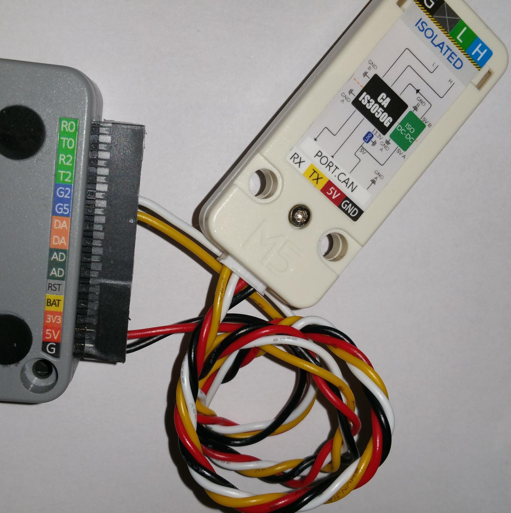

# slcan-m5
This repository is a fork of 
  https://github.com/mintynet/esp32-slcan

It is build with VScode platformio Arduino.

The only external hardware is the 3.3V CAN bus transceiver (SN65HVD230). 
It is connected to 3,3 V, GND, CAN TX (GPIO2) CAN RX (GPIO 5).
(There is a 120 ohm termination resistor (see picture) it can be that you have to remove it if the bus is already terminated)

You can also use the "M5Stack CANBus Unit(CA-IS3050G)". Use the cable "Grove 4 Pin Connector to Male Jumper Wire Cable".
It is connected to 5 V (red), GND (black), CAN TX (GPIO2) (white) CAN RX (GPIO 5) (yellow).

A CAN bus must be terminated on both ends with 120 ohm resistor. When the bus is switched off you should measure a resistance between CAN high and CAN low of 60 ohm +/-10.

##sniff mode

Until you didn't initialise slcan, you are in sniff mode. You can look if you get any data from the can bus and select the bus speed.
This will give you a chance to check the connection to the CAN bus.

##slcan mode

When sending data to the m5stack (USB-serial or bluetooth) sniff mode is deactivated.

##bluetooth

The m5stack can use bluetooth. When switching on, hold the middle button pressed.

###Optional

Optional the LovyanLauncher (https://github.com/lovyan03/M5Stack_LovyanLauncher) can be used. 
Please look at the youtube videos to get information of the LovyanLauncher.

The LovyanLauncher uses the sd card.
There can be more programs on the SD. So you can switch between differnet apps...
After LovyanLauncher is installed. 
Copy the compiled bin file .pio/build/esp32dev/firmware.bin into the root path of the LovyanLauncher SD (rename it to slcan-m5.bin).
To get pictures in the LovyanLauncher menu copy the files from the LovyanLauncher folder of the project to the SD.
(To simply copy the files to the SD use winscp and the LovyanLauncher -> Tools -> FTP Server (SDcard))
