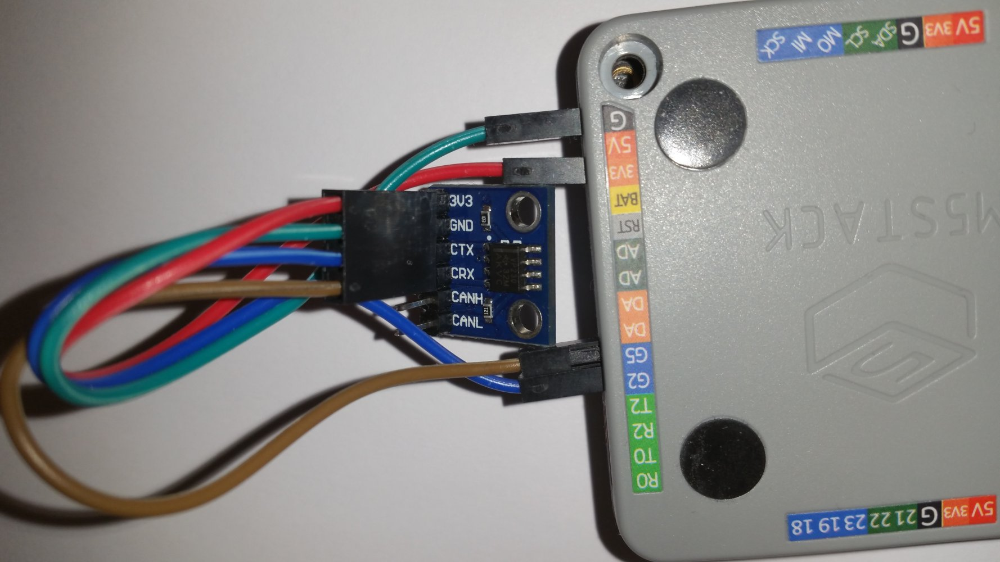
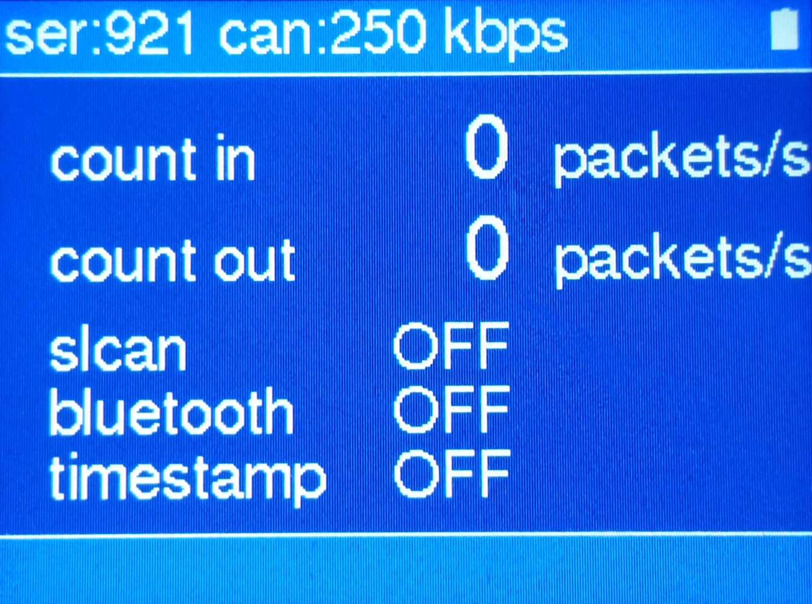

# slcan-m5
This repository is a fork of 
  https://github.com/mintynet/esp32-slcan

It is build with VScode platformio Arduino.

The only external hardware is the 3.3V CAN bus transceiver (SN65HVD230).
It is connected to 3,3 V, GND, CAN TX (GPIO2) CAN RX (GPIO 5).

###Optional

Optional the LovyanLauncher (https://github.com/lovyan03/M5Stack_LovyanLauncher) can be used. 
Please look at the youtube videos to get information of the LovyanLauncher.

The LovyanLauncher uses the sd card.
There can be more programs on the SD. So you can switch between differnet apps...
After LovyanLauncher is installed. 
Copy the compiled bin file .bin/build/m5stack-grey/firmware.bin into the root path of the LovyanLauncher SD (rename it to N2Kdisplay.bin).
To get pictures in the LovyanLauncher menu copy the files from the LovyanLauncher folder of the project to the SD.
(To simply copy the files to the SD use winscp and the LovyanLauncher -> Tools -> FTP Server (SDcard))
